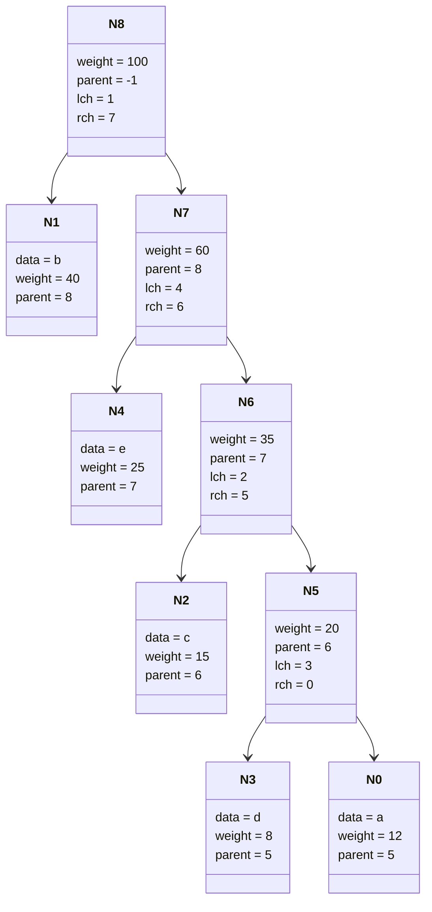
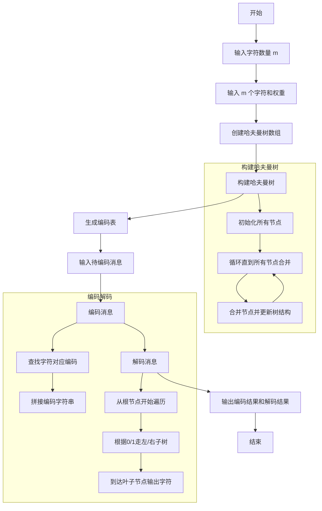

测试输入：
5 a b c d e 12 40 15 8 25
bbbaddeccbbb
预期输出：
00011111110111010110110000
bbbaddeccbbb

```mermaid
classDiagram
    class N8 {
        weight = 100
        parent = -1
        lch = 1
        rch = 7
    }
    class N1 {
        data = b
        weight = 40
        parent = 8
    }
    class N7 {
        weight = 60
        parent = 8
        lch = 4
        rch = 6
    }
    class N4 {
        data = e
        weight = 25
        parent = 7
    }
    class N6 {
        weight = 35
        parent = 7
        lch = 2
        rch = 5
    }
    class N2 {
        data = c
        weight = 15
        parent = 6
    }
    class N5 {
        weight = 20
        parent = 6
        lch = 3
        rch = 0
    }
    class N3 {
        data = d
        weight = 8
        parent = 5
    }
    class N0 {
        data = a
        weight = 12
        parent = 5
    }

    N8 --> N1
    N8 --> N7
    N7 --> N4
    N7 --> N6
    N6 --> N2
    N6 --> N5
    N5 --> N3
    N5 --> N0
```

```mermaid
flowchart TD
    A[开始] --> B[输入字符数量 m]
    B --> C[输入 m 个字符和权重]
    C --> D[创建哈夫曼树数组]
    D --> E[构建哈夫曼树]
    E --> F[生成编码表]
    F --> G[输入待编码消息]
    G --> H[编码消息]
    H --> I[解码消息]
    I --> J[输出编码结果和解码结果]
    J --> K[结束]

    subgraph 构建哈夫曼树
    E --> E1[初始化所有节点]
    E1 --> E2[选择权重最小的两个节点]
    E2 --> E3[合并节点并更新树结构]
    E3 --> E2[循环直到所有节点合并]
    end

    subgraph 编码解码
    H --> H1[查找字符对应编码]
    H1 --> H2[拼接编码字符串]
    I --> I1[从根节点开始遍历]
    I1 --> I2[根据0/1走左/右子树]
    I2 --> I3[到达叶子节点输出字符]
    end
```