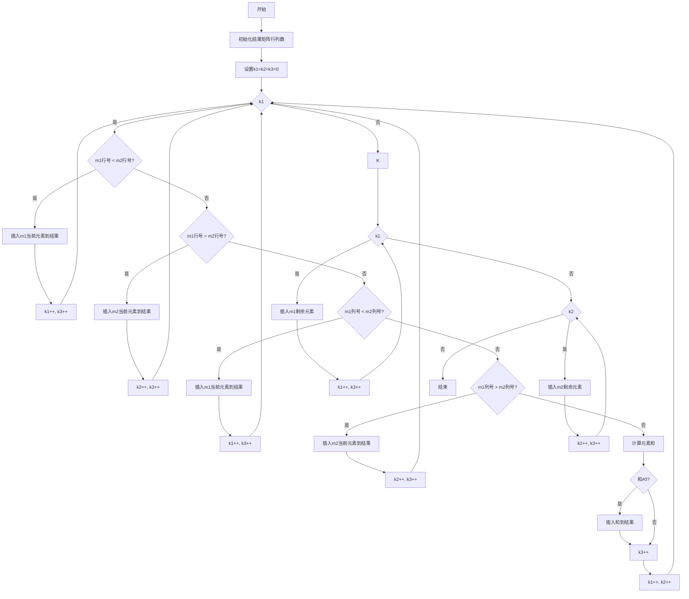
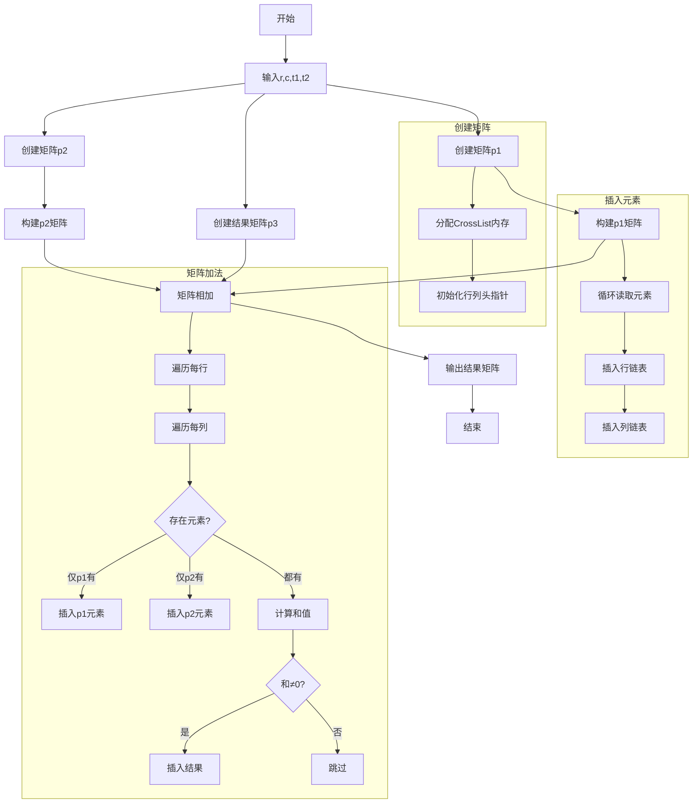
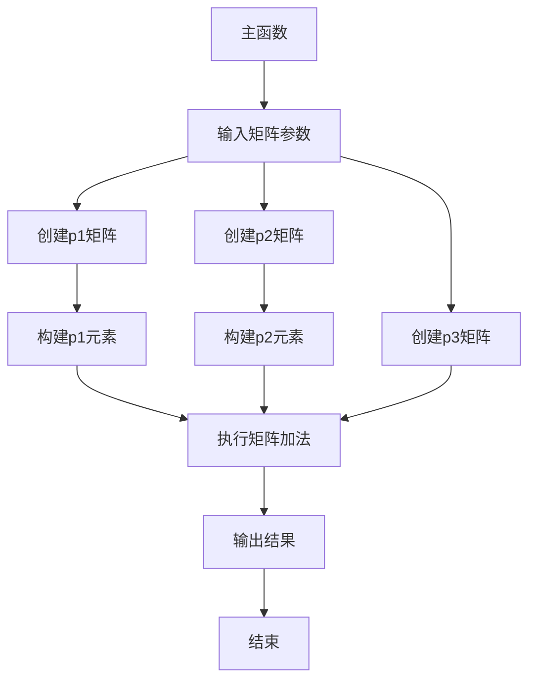
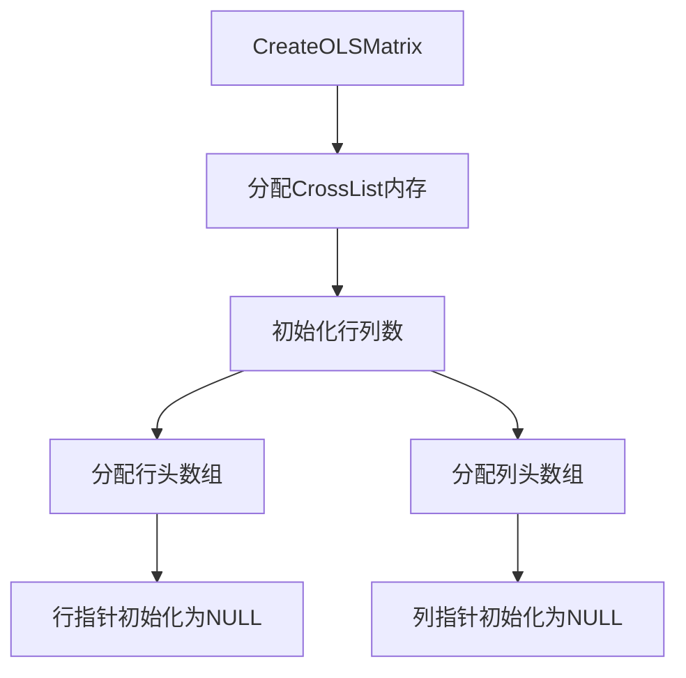
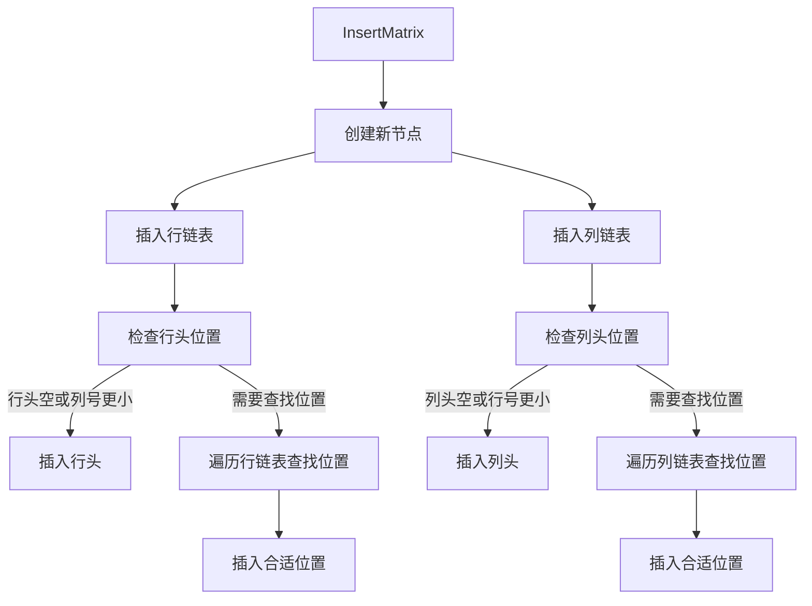
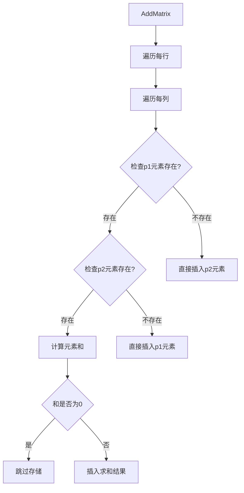
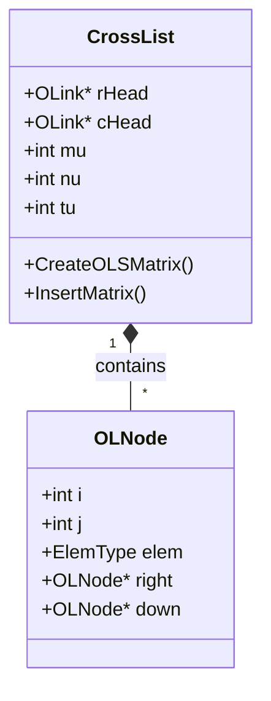
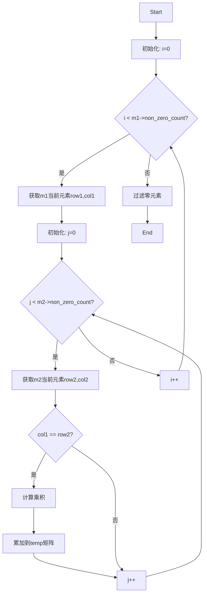
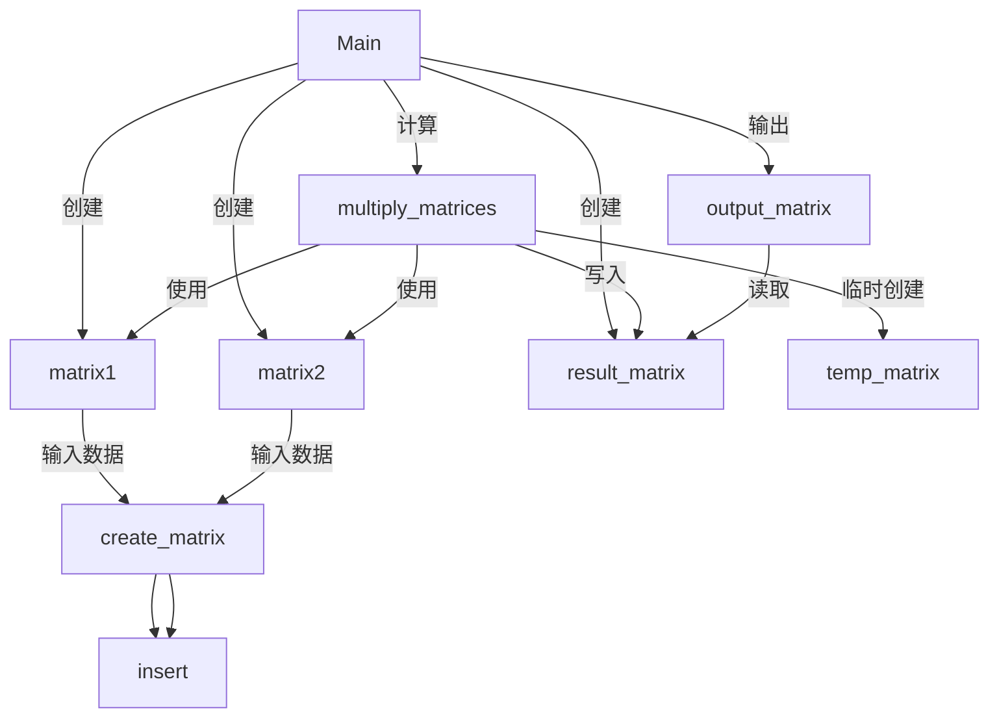

```flow
st=>start: 开始
get_input=>inputoutput: 输入矩阵信息(getinfo)
init_trans=>operation: 初始化转置矩阵B
trans_loop=>operation: 遍历A的非零元素 交换行列位置存入B
sort_matrix=>operation: 对B排序(seq)
print_result=>inputoutput: 输出转置结果(print)
e=>end: 结束

st->get_input->init_trans->trans_loop->sort_matrix->print_result->e
```

```flow
st=>start: 开始
e=>end: 结束
col_check=>condition: 行数<非零元素个数-1
colplus=>operation: 行数++
rowplus=>operation: 列数++
row_check=>condition: 列数<非零元素个数-1
sort_needed_check=>condition: 前列数>=后列数且前行数＞后行数
sort=>operation: 交换两者顺序

st->col_check
col_check(yes)->colplus->row_check
col_check(no)->e
row_check(yes)->rowplus->sort_needed_check
row_check(no)->e
sort_needed_check(yes)->sort
sort_needed_check(no)->row_check

```

```c
void seq(tsm *A)
{
	for(int j=0;j<A->len-1;j++)
	for (int i=0;i<A->len-1;i++)
	{
		if(A->data[i].rol>A->data[i+1].rol&&A->data[i].col>A->data[i+1].col)
		{
			int temp=A->data[i].col;
			A->data[i].col=A->data[i+1].col;
			A->data[i+1].col=temp;
			temp=A->data[i].rol;
			A->data[i].rol=A->data[i+1].rol;
			A->data[i+1].rol=temp;
			temp=A->data[i].e;
			A->data[i].e=A->data[i+1].rol;
			A->data[i+1].e=temp;
		}
	}
}
```


st=>start: 开始框

op=>operation: 处理框

cond=>condition: 判断框(是或否?)

sub1=>subroutine: 子流程

io=>inputoutput: 输入输出框

e=>end: 结束框

st->op->cond

cond(yes)->io->e

cond(no)->sub1(right)->op

```flow
st=>start: 开始
e=>end: 结束
io=>inputoutput: 输入m,n,t1,t2
CreatEmptyM=>operation: 创建三个空矩阵
CreatM=>operation: 创建矩阵M1,M2
add=>operation: 矩阵M1+M2放到M3
output=>operation: 输出结果矩阵M3
free=>operation: 释放内存

st->io->CreatEmptyM->CreatM->add->output->free->e
```

```flow
```



















